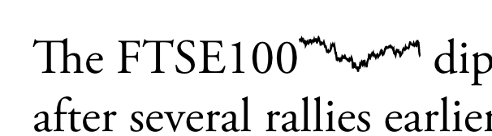

# Simple React Sparklines

A React implementation of Edward Tufte's concept of Sparklines.

The Sparkline graphic scales with the font size, and adopts the colour of
the font around it. To override this, props like `style` can be added just like
any HTML element, and will be passed into the inner SVG element. 