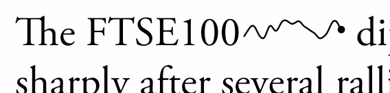

# Simple React Sparklines

A React implementation of font-size responsive [Sparklines](https://en.wikipedia.org/wiki/Sparkline). A Sparkline is a small unlabelled graphic with no axes, typically in-line with text, which shows the general trend of a dataset.



*Pic: an animated Sparkline created using `requestAnimationFrame`; demo found in the [animated-sparkline](../../tree/animated-sparkline) branch.*


# Use
The Sparkline graphic scales with the font size, and adopts the colour of
the font around it. To override this, props like `style` can be added just like
any HTML element, and will be passed into the inner SVG element.

```
<SparkLine data={stockData} />
<SparkLine data={stockData} min={-20} max={1280} />
<SparkLine data={stockData} style={...} />
```
